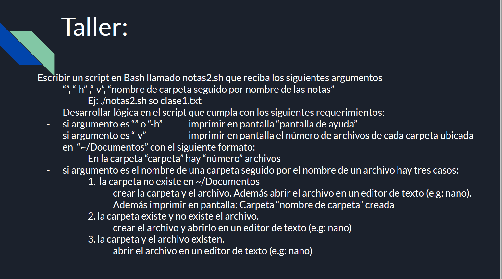

# practica_bash
  

	El archivo notas2.sh permite recibir los siguientes argumentos:
		-h    muestra esta pantalla de ayuda
 
		""   (espacio)  muestra esta pantalla de ayuda 
		-v    muestra el número de archivos de cada carpeta ubicada en "~/Documents"
		nombredecarpeta nombrearchivo ejemplo(./notas2.sh so clase1.txt) 
    
		Si el argumento es el nombre de una carpeta seguido por el nombre de un archivo
		hay tres casos:
    
		1. La carpeta no existe en ~/Documents, por lo tanto, se crea la carpeta, se muestra por
		pantalla el mesaje Carpeta "nombre de la carpeta" creada y el archivo
		 se abre en el editor de texto nano.
     
		2. la carpeta existe y no existe el archivo, por lo tanto, se crea el archivo 
		y se abre en el editor de texto nano.
    
		3. la carpeta y el archivo existe, por lo tanto, se abre el archivo en el editor 
		de texto nano.
